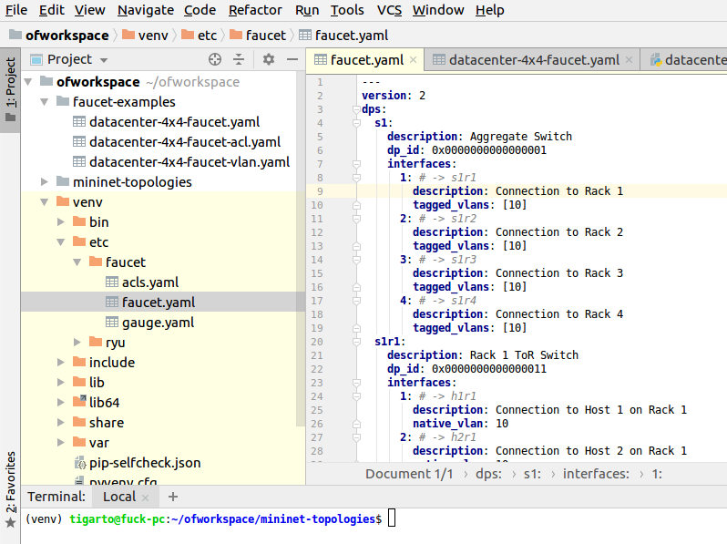
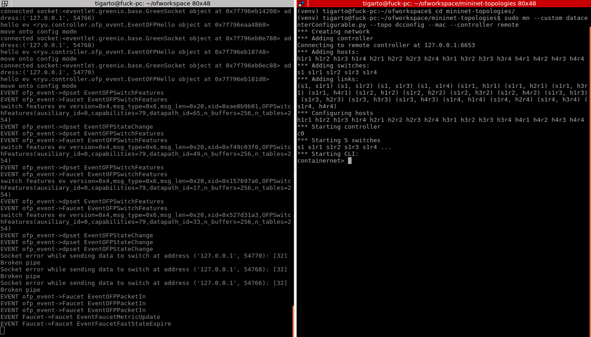

# Trabajo realizado #

## Resumen de la actividad ##
Se procederá a montar un entorno virtual de desarrollo sencillo en el cual se ejecute faucet siguiendo los pasos descritos en: https://inside-openflow.com/2016/08/23/faucet-virtual-infrastructure/. 


## Suposiciones ##
1. Se asume que ya se tiene instalado prometheus y grafana. Si esto aun no se cumple revisar los pasos descritos en: https://docs.faucet.nz/en/latest/tutorials/first_time.html
2. Hay detalles que cambian un poco respecto al tutorial que se sigue pues la version que se ejecula localmente es mas nueva.

# Instalación de Faucet en un entorno virtual #

## Instalación del entorno virtual ## 

En la [pagina seguida](https://inside-openflow.com/2016/08/23/faucet-virtual-infrastructure)

1. Instalar el entorno virtual:

```bash
# Install VirtualEnv (venv)
sudo apt install python-virtualenv

# Go to our workspace and setup the local venv
cd ~/ofworkspace
virtualenv venv

# Activate the venv
. ./venv/bin/activate
```

En nuestro caso, este procedimiento se llevo a cabo usando pycharm, por lo que los pasos anteriores no se ejecutaron. A continuación se muestra como:

**Paso 1**: Se crea un nuevo proyecto y un nuevo entorno virtual en pycharm:
  


El resultado del paso anterior es el siguiente:


2. En el directorio en el cual se vaya a trabajar instalar faucet tal y como se muestra en el siguiente [enlace](https://docs.faucet.nz/en/latest/installation.html#faucet-pip-install):

```bash
# Installation via pip
pip3 install git+https://github.com/faucetsdn/faucet.git
```

**Paso 2**: La aplicación del comando se muestra en la consola de pycharm:


Una vez el resultado se completa salío algo como lo siguiente:


3. En los directorios /venv/etc/faucet y /venv/var/faucet, se ubicaran los archivos de configuración y los logs de faucet respectivamante. La siguiente figura muestra esto en el arbol de directorios de faucet. Para el caso se despliega el contenido del archivo de configuración faucet.yml:


3. Vamos a proceder a experimentar con faucet. Inicialmente abrimos una nueva consola, y activamos el entorno virtual tal y como se muestra en la siguiente figura:


Los comandos aplicados fueron para el caso:

```bash
cd ~/ofworkspace
. ./venv/bin/activate
```

4. Comprobamos que ya podemos usar faucet, esto se hizo invocando su help:


5. Al correr faucet manualmente se puede verificar que este esta funcionando bien de acuerdo a los resultados que este este arrojando. Para ello se corrio el siguiente comando

```bash
faucet --verbose
```

El log para el caso fue el siguiente:


Para el caso del gauge se procede de manera similar:

```bash
gauge --verbose
```
## Creando una aplicación ## 

**Nota**: Estos archivos fueron obtenidos de: https://inside-openflow.com/2016/08/23/faucet-virtual-infrastructure/

1. Crear la topologia en mininet:


2. Editar el archivo de configuración del faucet (/venv/etc/faucet/faucet.yaml) de acuerdo a la topologia:



3. Iniciar el faucet:


4. Iniciar la topologia de mininet. A continuacíón se muestra el resultado (a la izquierda la consola asociada a faucet, a la derecha la consola asociada a mininet)



5. Interactuar con la topologia ejecutando diferentes comandos:


