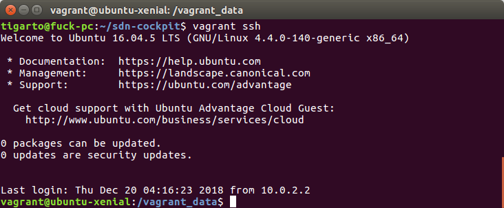
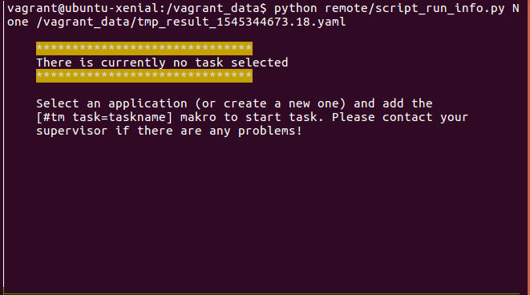
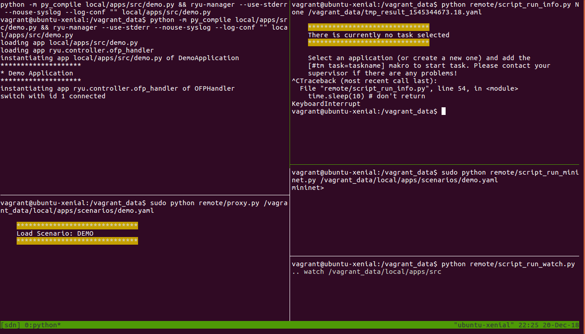

# Analizando sdn-cockpit: Open-source teaching framework for software-defined networking (SDN) # 

## Introducción ##

Esta plataforma educativa es de extrema utilidad para propositos de entrenamiento y en el caso dado para el desarrollo gradual
de la aplicación solución en el controlador, sea cual sea la necesidad; seguridad en nuestro caso. Conviene revisar los siguientes
enlaces:
1. [Teaching network softwarization with SDN Cockpit: An open ecosystem for students, network administrators and others](https://dl.gi.de/bitstream/handle/20.500.12116/16581/DFN-Forum-Proceedings-008.pdf?sequence=1&isAllowed=y)
2. [Teaching network softwarization with SDN Cockpit](https://www.dfn.de/fileadmin/7Veranstaltungen/Technologieforum/2018/Folien_Vortraege/TF_2108_Teaching_Network_Softwarization_Heseding.pdf)
3. [Repositorio github de sdn-cockpit](https://github.com/kit-tm/sdn-cockpit)

## Instalacion ##

En el [repositorio github de sdn-cockpit](https://github.com/kit-tm/sdn-cockpit) se muestran los pasos, estos basicamente se redujeron a:

1. Clonar el repositorio: 

```bash
cd ~
git clone https://github.com/kit-tm/sdn-cockpit.git
cd sdn-cockpit
```

2. Arrancar la maquina virtual (se debe estar en la carpeta sdn-cockpit que es donde se encuentra el vagrantfile):

```bash
vagrant up
```

3. Acceder a la maquina virtual por ssh (se debe estar en la carpeta sdn-cockpit): 

```bash
vagrant ssh
```
A continuación se muestra la maquina virtual:



4. Se llama el script run.sh:

```bash
# listando el directorio actual
ls
cwd  local  __mn_ready  remote  run.sh  templates  tmp_result_1545279556.93.yaml  tmp_topology.mn

# Ejecutando el script
./run.sh
```

5. Si todo esta bien aparece la siguiente interfaz de prueba:


**Nota**: como se  puede ver en la esquina superior izquierda hay un problema cargando la tarea (demo.yaml) en este momento por lo que se hace necesario reiniciar la tarea. La siguiente figura muestra esta parte de la interfaz para mayor claridad:



**Pasos adicionales para lograr cargar la tarea**:

6. En la esquina superior derecha ejecute la combinacion ```Ctrl + C```, el resultado se muestra a continuación:



7. Empleando el script **script_restart_task.sh** que se encuentra en el directorio **remote** cargue nuevamente la tarea asociada (**demo.yaml** para este caso) la cual se encuentra en el directorio **local/app/tasks/** asi:

```bash
./remote/script_restart_task.sh local/app/tasks/demo.yaml
```

Si todo esta bien ya se cargo la tarea tal y como se muestra en la siguiente figura:


8. Lo que resta es cacharrear y aprender lo que no se sabe. 

## Conclusiones ##
1. El uso de esta herramienta puede que sea fundamental cuando se est manipulando codigo del controlador para el desarrollo de la aplicación.
2. Hasta el momento solo nos centramos en la instalación.
3. La carga de la tarea fue un paso adicional que se hizo por que al principio las cosas no daban como esperabamos.


