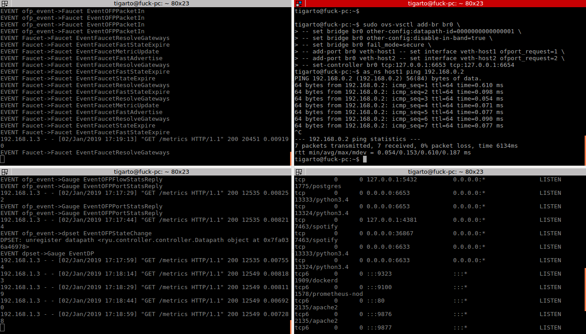

# Proceso de instalacion

El siguiente proceso de instalación se llevo los pasos descritos en: 
https://docs.faucet.nz/en/latest/tutorials/first_time.html. Para el caso se tratara de ir documentando el procedimiento de la manera mas fiel posible y en lo posible hacer observaciones en donde se tuvieron problemas recalcando las soluciones o intentos que se hicieron al respecto.

## Instalacion de Faucet ##

Siguiendo lo descrito en la siguiente [URL](https://docs.faucet.nz/en/latest/tutorials/first_time.html#installing-faucet-for-the-first-time) se llevaron a cabo los siguientes pasos:

1. Se agrego el repositorio oficial en el sistema

```bash
sudo apt-get install curl gnupg apt-transport-https lsb-release
echo "deb https://packagecloud.io/faucetsdn/faucet/$(lsb_release -si | awk '{print tolower($0)}')/ $(lsb_release -sc) main" | sudo tee /etc/apt/sources.list.d/faucet.list
curl -L https://packagecloud.io/faucetsdn/faucet/gpgkey | sudo apt-key add -
sudo apt-get update
```

2. Se llevo a cabo la instalacion de todos los paquetes:

```bash
sudo apt-get install faucet-all-in-one
```

**Observaciones**: Proceso sin novedad. Todo dio sin problemas.


## Configuración de prometheus ##

En la pagina se muestra el archivo de configuración (el cual se encuentra en: **/etc/faucet/prometheus/**) de prometheus **prometheus.yml** asi:

```yaml
# my global config
global:
  scrape_interval:     15s # Set the scrape interval to every 15 seconds. Default is every 1 minute.
  evaluation_interval: 15s # Evaluate rules every 15 seconds. The default is every 1 minute.
  # scrape_timeout is set to the global default (10s).

# Load rules once and periodically evaluate them according to the global 'evaluation_interval'.
rule_files:
  - "faucet.rules.yml"

# A scrape configuration containing exactly one endpoint to scrape:
# Here it's Prometheus itself.
scrape_configs:
  # The job name is added as a label `job=<job_name>` to any timeseries scraped from this config.
  - job_name: 'prometheus'
    static_configs:
      - targets: ['localhost:9090']
  - job_name: 'faucet'
    static_configs:
      - targets: ['localhost:9302']
  - job_name: 'gauge'
    static_configs:
      - targets: ['localhost:9303']
```
Sin embargo, para que diera (no se por que), la dirección IP **localhost** debe ser cambiada por la IP de la interfaz de red de la maquina en la que se estan haciendo las pruebas. Usando ifconfig 

```bash
(venv) tigarto@fuck-pc:~/ofworkspace/mininet-topologies$ ifconfig 
docker0   Link encap:Ethernet  ...
          ...

lo        Link encap:Local Loopback  
          inet addr:127.0.0.1 ...
          ...

wlp2s0    Link encap:Ethernet  ...
          inet addr:192.168.1.3 ... 
          ...
```
Según lo anterior lo que se hizo fue cambiar la dirección **localhost** por la dirección IP de **wlp2s0** la cual es **192.168.1.3**. De este modo el archivo quddo asi:

```yaml
# my global config
global:
  scrape_interval:     15s # Set the scrape interval to every 15 seconds. Default is every 1 minute.
  evaluation_interval: 15s # Evaluate rules every 15 seconds. The default is every 1 minute.
  # scrape_timeout is set to the global default (10s).

# Load rules once and periodically evaluate them according to the global 'evaluation_interval'.
rule_files:
  - "faucet.rules.yml"

# A scrape configuration containing exactly one endpoint to scrape:
# Here it's Prometheus itself.
scrape_configs:
  # The job name is added as a label `job=<job_name>` to any timeseries scraped from this config.
  - job_name: 'prometheus'
    static_configs:
      - targets: ['192.168.1.3:9090']
  - job_name: 'faucet'
    static_configs:
      - targets: ['192.168.1.3:9302']
  - job_name: 'gauge'
    static_configs:
      - targets: ['192.168.1.3:9303']
```
Los pasos para hacer que prometheus use el archivo de configuracion asociado a faucet se llevaron a cabo sin novedad. Luego, se procedió a reiniciar prometheus:

```bash
tigarto@fuck-pc:~$ sudo systemctl restart prometheus
```

Finalmente, ya es posible acceder a la interfaz web de prometheus: http://localhost:8080

**Conclusiones**:
* Para que prometheus (quede configurado por lo menos para) fue necesario editar el archivo de configuración **prometheus.yaml** pues sino aparecerá un error similar al descrito en el siguiente link: https://github.com/prometheus/prometheus/issues/2008. Tambien el siguiente enlace: https://github.com/prometheus/node_exporter/issues/636 muestra este problema.
* Despues de las modificaciones se sospecha que ya prometheus esta listo.

## Configuración de grafana ##

La parte de grafana jodio:

Se llevo a cabo el paso 1 en el cual lo que se hace iniciar grafana  en boot y entonces inicializarlo manualmente la primera vez. Para ello se ejecutaron los comandos:

```bash
sudo systemctl daemon-reload
sudo systemctl enable grafana-server
sudo systemctl start grafana-server
```
La salida de estos se muestra a continuación:

```bash
tigarto@fuck-pc:~$ sudo systemctl daemon-reload
tigarto@fuck-pc:~$ sudo systemctl enable grafana-server
Synchronizing state of grafana-server.service with SysV init with /lib/systemd/systemd-sysv-install...
Executing /lib/systemd/systemd-sysv-install enable grafana-server
insserv: warning: script 'sonata' missing LSB tags and overrides
insserv: warning: script 'sonata' missing LSB tags and overrides
```
El problema despues de esto fue que no se podia acceder a grafana desde el browser (http://localhost:3000)

Para el caso la solución fue parando e inicializando el grafana:

```bash
tigarto@fuck-pc:~$ sudo systemctl stop grafana-server
tigarto@fuck-pc:~$ sudo systemctl start grafana-server
tigarto@fuck-pc:~$ sudo systemctl enable grafana-server
Synchronizing state of grafana-server.service with SysV init with /lib/systemd/systemd-sysv-install...
Executing /lib/systemd/systemd-sysv-install enable grafana-server
insserv: warning: script 'sonata' missing LSB tags and overrides
insserv: warning: script 'sonata' missing LSB tags and overrides
```
Luego de hacer lo anterior, pese a los warning ya fue posible acceder a grafana (http://localhost:3000). En lo que respecta a los demas pasos al parecer todo dio.

## Configuración de faucet ##

Inicialmente se codifica el archivo de configuracion de faucet ([faucet.yaml](faucet.yaml)), el cual, para el caso se encontrará en /etc/faucet/.

Luego se procede a verificar la configuración:

```bash
check_faucet_config /etc/faucet/faucet.yaml
```
Si todo esta bien la salida será un JSON object con la estructura de configuración completa tal y como se muestra en el siguiente [enlace](salida.json)

Luego se procede a reiniciar el faucet:

```bash
sudo systemctl start faucet
sudo systemctl reload faucet
```

Como no estaba inicializado toco inicializarlo, luego se chequean los logs (/var/log/faucet/faucet.log), para el caso la salida dio algo como:


```bash
cat /var/log/faucet/faucet.log
...
Dec 31 14:13:27 faucet.valve INFO     DPID 1 (0x1) sw1 Configuring VLAN office vid:100 untagged: Port 1,Port 2
Jan 01 17:38:22 faucet.valve WARNING  DPID 1 (0x1) sw1 datapath down
```

Son aproximadamente las 16:40 del 01 de enero de 2019, asi que deben hacer problemas. Por ello se intento entonces hacer la operación anterior con el comando:

```bash
faucet --verbose
```

Sin embargo, hay problemas cuando se llevo a cabo la ejecución de faucet, tal y como queda evidenciado cuando se intenta ejcutar este:

```bash
faucet --verbose
```
Pues se tiene la siguiente salida:

```bash
tigarto@fuck-pc:~$ faucet --verbose
loading app faucet.faucet
Traceback (most recent call last):
  File "/usr/local/bin/ryu-manager", line 11, in <module>
    load_entry_point('ryu==4.24', 'console_scripts', 'ryu-manager')()
  File "/usr/local/lib/python2.7/dist-packages/ryu/cmd/manager.py", line 98, in main
    app_mgr.load_apps(app_lists)
  File "/usr/local/lib/python2.7/dist-packages/ryu/base/app_manager.py", line 415, in load_apps
    cls = self.load_app(app_cls_name)
  File "/usr/local/lib/python2.7/dist-packages/ryu/base/app_manager.py", line 392, in load_app
    mod = utils.import_module(name)
  File "/usr/local/lib/python2.7/dist-packages/ryu/utils.py", line 108, in import_module
    return importlib.import_module(modname)
  File "/usr/lib/python2.7/importlib/__init__.py", line 37, in import_module
    __import__(name)
ImportError: No module named faucet.faucet
```

Para poder arreglar el problema, se reinstalo el componente asociado al faucet, pues la verdad no se por que con la instalación llevada a cabo desde los repositorios, pues la cosa no dio. Para ello teniendo en cuenta que la maquina local tiene varias versiones (2.7, 3.5, 3.4) de python se ensayo la instalación para cada una de estas. Al final el unico caso exitoso fue cuando se llevo a cabo la instalación para la versión 3.4: 

```bash
sudo pip3.4 install faucet 
```
Ahora llevando la ejecucion del faucet:

```bash
sudo faucet --verbose
loading app faucet.faucet
loading app ryu.controller.ofp_handler
instantiating app None of DPSet
creating context dpset
creating context faucet_experimental_api
instantiating app ryu.controller.ofp_handler of OFPHandler
instantiating app faucet.faucet of Faucet
BRICK ofp_event
  PROVIDES EventOFPErrorMsg TO {'Faucet': {'main'}}
  PROVIDES EventOFPDescStatsReply TO {'Faucet': {'main'}}
  PROVIDES EventOFPPacketIn TO {'Faucet': {'main'}}
  PROVIDES EventOFPStateChange TO {'dpset': {'dead', 'main'}}
  PROVIDES EventOFPPortStatus TO {'dpset': {'main'}, 'Faucet': {'main'}}
  PROVIDES EventOFPSwitchFeatures TO {'dpset': {'config'}, 'Faucet': {'config'}}
  PROVIDES EventOFPFlowRemoved TO {'Faucet': {'main'}}
  CONSUMES EventOFPEchoRequest
  CONSUMES EventOFPHello
  CONSUMES EventOFPPortDescStatsReply
  CONSUMES EventOFPEchoReply
...
```

Y analizando el log:

```bash
cat /var/log/faucet/faucet.log
...
Jan 01 17:38:22 faucet.valve WARNING  DPID 1 (0x1) sw1 datapath down
Jan 02 16:41:11 faucet INFO     Reloading configuration
Jan 02 16:41:11 faucet INFO     configuration /etc/faucet/faucet.yaml changed, analyzing differences
Jan 02 16:41:11 faucet INFO     Add new datapath DPID 1 (0x1)
Jan 02 16:41:11 faucet.valve INFO     DPID 1 (0x1) sw1 table ID 0 table config match_types: (('eth_dst', True), ('eth_type', False), ('in_port', False), ('vlan_vid', False)) name: vlan next_tables: ['eth_src'] output: True set_fields: ('vlan_vid',) size: 32 vlan_port_scale: 1.5
Jan 02 16:41:11 faucet.valve INFO     DPID 1 (0x1) sw1 table ID 1 table config match_types: (('eth_dst', True), ('eth_src', False), ('eth_type', False), ('in_port', False), ('vlan_vid', False)) miss_goto: eth_dst name: eth_src next_tables: ['eth_dst', 'flood'] output: True set_fields: ('vlan_vid', 'eth_dst') size: 32 table_id: 1 vlan_port_scale: 4.1
Jan 02 16:41:11 faucet.valve INFO     DPID 1 (0x1) sw1 table ID 2 table config exact_match: True match_types: (('eth_dst', False), ('vlan_vid', False)) miss_goto: flood name: eth_dst output: True size: 32 table_id: 2 vlan_port_scale: 4.1
Jan 02 16:41:11 faucet.valve INFO     DPID 1 (0x1) sw1 table ID 3 table config match_types: (('eth_dst', True), ('in_port', False), ('vlan_vid', False)) name: flood output: True size: 32 table_id: 3 vlan_port_scale: 2.1
```

**Conclusiones**:
* Fue necesario reinstalar faucet con pip.
* La opcion con systemctl no arranca el faucet como esperariamos, esto se puede ver en el log.

## Configuración de gauge ##

De manera similar al faucet existe un archivo de configuración en /etc/faucet/gauge.yaml el cual se puede apreciar en el siguiente [enlace](gauge.yaml). 

Al iniciar el gauge :

```bash
sudo gauge --verbose
...
BRICK Gauge
  CONSUMES EventDP
  CONSUMES EventOFPFlowStatsReply
  CONSUMES EventOFPPortStatus
  CONSUMES EventReconfigure
  CONSUMES EventDPReconnected
  CONSUMES EventOFPPortStatsReply
(12155) wsgi starting up on http://0.0.0.0:9303

```

Asi mismo en el log:

```bash
cat /var/log/faucet/gauge.log
...
Jan 01 17:38:22 gauge  INFO     DPID 1 (0x1) down
Jan 01 17:38:22 gauge.port_stats INFO     stopping
Jan 01 17:38:22 gauge.flow_table INFO     stopping
Jan 02 16:57:07 gauge  INFO     Reloading configuration
Jan 02 16:57:07 gauge  INFO     config complete
```

## Conexión de los datapath ##

Para la comprensión de conceptos sumamente importantes en esta sección se recomienda revisar el siguiente [enlace](http://mobiquo.gsyc.es/lab-sdn/materialesPrevios/sdn.pdf).

Asumiendo que el ovs ya se encuentra instalado inicialmente se agregan los network namespaces para simular los host:

```bash
create_ns () {
    NETNS=$1
    IP=$2
    sudo ip netns add ${NETNS}
    sudo ip link add dev veth-${NETNS} type veth peer name veth0 netns $NETNS
    sudo ip link set dev veth-${NETNS} up
    sudo ip netns exec $NETNS ip link set dev veth0 up
    sudo ip netns exec $NETNS ip addr add dev veth0 $IP
    sudo ip netns exec $NETNS ip link set dev lo up
}

as_ns () {
    NETNS=$1
    shift
    sudo ip netns exec $NETNS $@
}
```

Se crean los host1 y host2 y se les asigna alguna IP:

```bash
create_ns host1 192.168.0.1/24
create_ns host2 192.168.0.2/24
```

Luego se procede a configurar ovs:

```bash
sudo ovs-vsctl add-br br0 \
-- set bridge br0 other-config:datapath-id=0000000000000001 \
-- set bridge br0 other-config:disable-in-band=true \
-- set bridge br0 fail_mode=secure \
-- add-port br0 veth-host1 -- set interface veth-host1 ofport_request=1 \
-- add-port br0 veth-host2 -- set interface veth-host2 ofport_request=2 \
-- set-controller br0 tcp:127.0.0.1:6653 tcp:127.0.0.1:6654
```

Posteriormente se procedio a generar trafico entre el host1 y el host2:

```bash
as_ns host1 ping 192.168.0.2
```

En la siguiente figura se muestra el resultado:



Aqui se corre el faucet en la terminal superior izquierda, el gauge en la terminal inferior izquierda. Ademas se instanacian los host y el openvswitch, asi como se ejecuta el ping entre dichos host en la terminal superior derecha. Finalmente se muestran los puertos abiertos en la terminal inferior derecha empleando el comando ```bash sudo netstat -plnt``` (para mas informacion ver el siguiente [enlace](https://support.rackspace.com/how-to/checking-listening-ports-with-netstat/))


Ojo analizar:
* https://github.com/gwacter-zz/sdn-workshop/blob/master/exercises/04-faucet.md
* http://installfights.blogspot.com/2016/10/mininet-ryu-faucet-gauge-influxdb.html
* https://github.com/MrMCandR/COMP514-Assignment-One
* https://github.com/onfsdn/faucet_db/tree/master/faucet
* http://www.openvswitch.org/support/ovscon2016/8/1450-mysore.pdf
* http://mobiquo.gsyc.es/lab-sdn/

Se instalo lo siguiente:

sudo pip install faucet==1.7.7

parece que dio algo. No nada con el caso anterior no dio

sudo pip3.4 install faucet   (Con este si como que dio algo)


Ahora si

```bash
sudo systemctl start faucet
sudo systemctl reload faucet
```

Ver:

http://ask.xmodulo.com/remove-network-namespaces-linux.html

$ sudo ip netns <namespace-name> delete

sudo ip netns  host1 delete


Para acabar 

```
tigarto@fuck-pc:~$ sudo systemctl stop faucet
tigarto@fuck-pc:~$ sudo systemctl stop prometheus
tigarto@fuck-pc:~$ sudo systemctl stop gauge
tigarto@fuck-pc:~$ sudo systemctl start grafana-server
```

```bash
tigarto@fuck-pc:~$ cat /var/log/faucet/faucet.log
Dec 24 03:12:17 faucet INFO     Reloading configuration
Dec 24 03:12:17 faucet INFO     configuration /etc/faucet/faucet.yaml changed, analyzing differences
Dec 24 03:12:17 faucet INFO     Add new datapath DPID 1 (0x1)
Dec 24 03:12:17 faucet.valve INFO     DPID 1 (0x1) sw1 table ID 0 table config match_types: (('eth_dst', True), ('eth_type', False), ('in_port', False), ('vlan_vid', False)) name: vlan next_tables: ['eth_src'] output: True set_fields: ('vlan_vid',) size: 32 vlan_port_scale: 1.5
Dec 24 03:12:17 faucet.valve INFO     DPID 1 (0x1) sw1 table ID 1 table config match_types: (('eth_dst', True), ('eth_src', False), ('eth_type', False), ('in_port', False), ('vlan_vid', False)) miss_goto: eth_dst name: eth_src next_tables: ['eth_dst', 'flood'] output: True set_fields: ('vlan_vid', 'eth_dst') size: 32 table_id: 1 vlan_port_scale: 4.1
Dec 24 03:12:17 faucet.valve INFO     DPID 1 (0x1) sw1 table ID 2 table config exact_match: True match_types: (('eth_dst', False), ('vlan_vid', False)) miss_goto: flood name: eth_dst output: True size: 32 table_id: 2 vlan_port_scale: 4.1
Dec 24 03:12:17 faucet.valve INFO     DPID 1 (0x1) sw1 table ID 3 table config match_types: (('eth_dst', True), ('in_port', False), ('vlan_vid', False)) name: flood output: True size: 32 table_id: 3 vlan_port_scale: 2.1

```

Error:
```bash
tigarto@fuck-pc:/lib/systemd/system$ sudo systemctl status faucet
● faucet.service - "Faucet OpenFlow switch controller"
   Loaded: loaded (/lib/systemd/system/faucet.service; enabled; vendor preset: enabled)
   Active: failed (Result: start-limit-hit) since lun 2018-12-24 01:04:08 -05; 31min ago
     Docs: https://docs.faucet.nz
  Process: 7496 ExecReload=/bin/kill -HUP $MAINPID (code=exited, status=0/SUCCESS)
  Process: 7554 ExecStart=/usr/bin/faucet --ryu-config-file=${FAUCET_RYU_CONF} --ryu-ofp-tcp-listen
 Main PID: 7554 (code=exited, status=1/FAILURE)

dic 24 01:04:07 fuck-pc systemd[1]: faucet.service: Unit entered failed state.
dic 24 01:04:07 fuck-pc systemd[1]: faucet.service: Failed with result 'exit-code'.
dic 24 01:04:08 fuck-pc systemd[1]: faucet.service: Service hold-off time over, scheduling restart.
dic 24 01:04:08 fuck-pc systemd[1]: Stopped "Faucet OpenFlow switch controller".
dic 24 01:04:08 fuck-pc systemd[1]: faucet.service: Start request repeated too quickly.
dic 24 01:04:08 fuck-pc systemd[1]: Failed to start "Faucet OpenFlow switch controller".
dic 24 01:04:08 fuck-pc systemd[1]: faucet.service: Unit entered failed state.
dic 24 01:04:08 fuck-pc systemd[1]: faucet.service: Failed with result 'start-limit-hit'.
dic 24 01:29:48 fuck-pc systemd[1]: faucet.service: Unit cannot be reloaded because it is inactive.
tigarto@fuck-pc:/lib/systemd/system$ clear
```

solucion: 

```bash
tigarto@fuck-pc:/lib/systemd/system$ sudo systemctl stop faucet
tigarto@fuck-pc:/lib/systemd/system$ sudo systemctl disable faucet
Removed symlink /etc/systemd/system/multi-user.target.wants/faucet.service.
tigarto@fuck-pc:/lib/systemd/system$ sudo systemctl enable faucet
Created symlink from /etc/systemd/system/multi-user.target.wants/faucet.service to /lib/systemd/system/faucet.service.
tigarto@fuck-pc:/lib/systemd/system$ 
```
